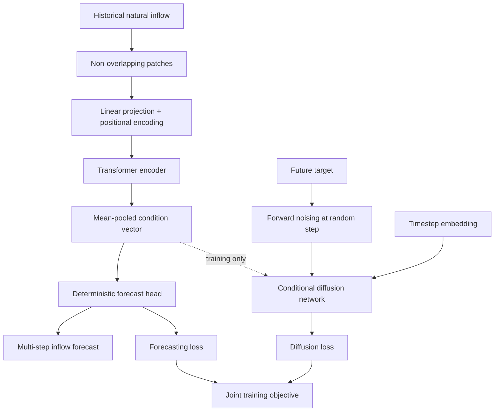

# ACD-PatchT

**Auxiliary Conditional Diffusion Patch Transformer**

ACD-PatchT combines a patch-based Transformer forecasting backbone with an auxiliary conditional diffusion objective. The diffusion branch regularizes the learned temporal representation during training and is removed during inference. Forecasts are therefore produced directly, without iterative reverse-diffusion sampling.

## Highlights

- Non-overlapping temporal patches reduce the effective input sequence length.
- A Transformer encoder captures local and long-range temporal relationships.
- Conditional diffusion supplies an auxiliary noise-prediction task during training.
- The shared historical representation supports both forecasting and diffusion conditioning.
- Inference uses only the Transformer backbone and deterministic forecast head.

## Architecture



During training, the target sequence is embedded and corrupted at a randomly sampled diffusion step. The diffusion network predicts the added Gaussian noise using the noisy target representation, condition vector, and timestep embedding. The complete objective is

$$
\mathcal{L}=\mathcal{L}_{\mathrm{forecast}}+\lambda_{\mathrm{diff}}\mathcal{L}_{\mathrm{diffusion}}.
$$

During inference, the diffusion branch is omitted:

$$
\widehat{\mathbf{y}}_t=f_{\mathrm{forecast}}(\mathbf{x}_t).
$$

## Dataset

The principal experiment uses natural inflow and precipitation observations for the **Tucuruí hydroelectric power plant**, located in the Tocantins River basin in northern Brazil. The final forecasting configuration uses historical natural inflow only. Precipitation was evaluated as an exogenous variable: it reduced SMAPE but increased RMSE and MAE, so it was not retained in the final model. Additional natural inflow data used for the generalization study are available from the [ONS hydrological open-data portal](https://dados.ons.org.br/dataset/dados_hidrologicos_ho). Hourly observations were aggregated into daily means for this analysis. Both datasets can be downloaded using [this algorithm](Algorithm/00_download_data.py).


### Data preparation

1. Sort observations chronologically.
2. Split the series into 70% training, 10% validation, and 20% test subsets.
3. Calculate the mean and standard deviation using only the training subset.
4. Standardize the complete series using the training statistics.
5. Construct sliding windows with a 64-step lookback and the selected forecasting horizon.
6. Convert predictions back to m³/s before computing the metrics.

This procedure prevents test-set information from entering normalization or hyperparameter selection.

## Optimized configuration

The Tree-structured Parzen Estimator (TPE) evaluated 100 trials using validation RMSE as the objective. The selected configuration was retrained from scratch across 50 independent random seeds.

| Hyperparameter | Optimized value |
|---|---:|
| Lookback | 64 |
| Patch size | 16 |
| Model dimension | 128 |
| Attention heads | 8 |
| Transformer layers | 1 |
| Diffusion steps | 25 |
| Dropout | 0.156 |
| FFN multiplier | 4 |
| Diffusion hidden dimension | 512 |
| Diffusion weight | 2.31 × 10⁻⁴ |
| Batch size | 64 |
| Learning rate | 8.02 × 10⁻⁵ |
| Weight decay | 9.47 × 10⁻³ |
| Gradient clipping | 1.0 |

## Experimental protocol

- Forecasting horizon: 7 steps for the principal comparison
- Generalization horizons: 1, 3, 5, 7, 9, 11, 13, and 15 steps
- Independent runs: 50 random initializations
- Maximum training length: 500 epochs
- Optimizer: AdamW
- Metrics: RMSE, MAE, and SMAPE
- Statistical analysis: paired Wilcoxon signed-rank test where applicable
- Testing set: the entire held-out test subset

Reported values are the mean ± sample standard deviation across the 50 runs.

## Main results

### Seven-step forecasting at Tucuruí

| Model | RMSE (m³/s) | MAE (m³/s) | SMAPE (%) |
|---|---:|---:|---:|
| **ACD-PatchT** | **843 ± 23.4** | **459 ± 19.3** | 9.78 ± 1.76 |
| DeepAR | 850 ± 13.6 | 480 ± 19.7 | 10.5 ± 1.29 |
| MLP | 897 ± 34.1 | 509 ± 42.6 | 10.7 ± 2.72 |
| NHITS | 941 ± 24.4 | 479 ± 12.6 | **8.00 ± 0.16** |
| N-BEATS | 953 ± 25.9 | 485 ± 10.0 | 8.09 ± 0.14 |

ACD-PatchT obtained the lowest RMSE and MAE among the 13 benchmark architectures. Relative to DeepAR, the second-best model by RMSE, it reduced RMSE by approximately 0.82% and MAE by approximately 4.38%. NHITS achieved the lowest SMAPE.

The average training time was 503 s, while deterministic inference required approximately 0.043 s per forecasting window in the reference environment.

### Ablation findings

| Modification | RMSE change relative to full model |
|---|---:|
| Without diffusion residual | +0.38% |
| Without patching | +1.80% |
| Without diffusion | +2.17% |
| Without timestep embedding | +2.34% |
| Unconditional diffusion | +2.71% |
| Without positional encoding | +56.81% |

Positional encoding had the largest measured contribution. Patching and the auxiliary diffusion objective provided smaller but consistent improvements in absolute forecasting accuracy.

### Generalization

The same approach was evaluated at five Brazilian hydroelectric power plants:

- Tucuruí
- Baguari
- Sobradinho
- Campos Novos
- Belo Monte

The experiments cover different Brazilian regions, river basins, reservoir configurations, and flow regimes. Accuracy generally decreased as the forecasting horizon increased, while computation time per window remained nearly constant. Performance varied substantially among plants, indicating that plant-specific adaptation or transfer learning may be beneficial for heterogeneous hydrological regimes.

## Explainability

Gradient-based and occlusion analyses showed that ACD-PatchT relies primarily on the most recent inflow observations. The observation immediately before the forecast origin received the greatest gradient importance, and the most recent input patch was dominant in the occlusion study. Selected earlier time steps also contributed to the predictions.

## Limitations

- The model produces deterministic point forecasts and does not quantify predictive uncertainty.
- Forecasting errors increase at longer horizons and during extreme-flow conditions.
- Performance depends on the hydrological regime and value distribution of each plant.
- The auxiliary diffusion objective increases training time, although it does not increase inference complexity.
- Additional exogenous variables require careful selection because irrelevant variability may degrade absolute-error metrics.

## Citation

If you use ACD-PatchT in your research, please cite:

```bibtex
@article{stefenon2026acdpatcht,
  title   = {ACD-PatchT: An Auxiliary Conditional Diffusion Patch Transformer for Multi-step Natural Inflow Forecasting in Hydroelectric Power Plants},
  author  = {Stefenon, Stefano Frizzo and Seman, Laio Oriel and Yow, Kin-Choong},
  year    = {2026},
  note    = {Manuscript}
}
```

---

## 👨‍🏫 Stefano Frizzo Stefenon, PhD  

### 🔬 Academic Profiles
<p align="left">
<a href="https://scholar.google.com/citations?user=ToyM0y8AAAAJ"></a>
<a href="https://www.scopus.com/authid/detail.uri?authorId=57194147390"></a>
<a href="https://www.webofscience.com/wos/author/record/AAD-7639-2019"></a>
<a href="https://orcid.org/0000-0002-3723-616X"></a>
<a href="https://www.researchgate.net/profile/Stefano-Frizzo-Stefenon-2"></a>
<a href="https://www.linkedin.com/in/stefanostefenon/"></a>
</p>
